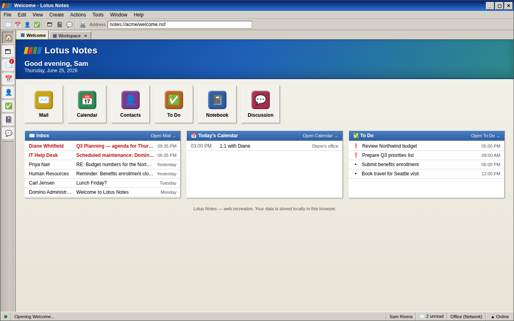

# Lotus Notes

A faithful, working recreation of the classic IBM/Lotus Notes groupware client,
built for the browser. It looks like Notes (the Windows 2000-era beveled chrome,
the colorful Workspace of database tiles, the green action bars, the yellow
legal-pad memo) and it *performs* like Notes: a real mail client, calendar,
address book, to-do list, notebook, and threaded discussion, all sharing one
document store that persists in your browser.



## Features

The desktop is the familiar faux-OS window: a title bar, pulldown menu bar,
SmartIcons toolbar, the left **bookmark bar**, **window tabs** for every open
view, and a multi-segment **status bar**.

- **Welcome** — a home dashboard with launch tiles and live panels (inbox,
  today's calendar, open to-dos).
- **Workspace** — the signature tabbed pages of 3-D database tiles on teal felt;
  double-click a tile to open its application. Tile counts are live.
- **Mail** — three-pane client (folder navigator · message list · reading pane)
  with the yellow memo form. Compose, reply / reply-all / forward, drafts, sent,
  follow-up flags, read/unread, search, and a Trash you can empty.
- **Calendar** — Day / Work Week / Week / Month / All Entries views, color-coded
  entry types, period navigation, and a full entry form (location, invitees,
  alarm, all-day, categories).
- **Contacts** — a Personal Address Book with views by name / company / category,
  a business-card preview, a full person form, and "Write Memo" that opens Mail
  pre-addressed to the contact.
- **To Do** — grouped and filtered task views (by category / status / due date,
  plus Overdue and High-Priority quick filters), an inline complete checkbox,
  and a detail editor.
- **Notebook** — a personal journal with category navigation and a yellow-memo
  note editor that auto-saves.
- **Discussion** — a threaded team database with collapsible reply trees, a
  reading pane, and inline compose for topics and replies.

Everything you create is saved to the browser's `localStorage`, so the desktop
is exactly as you left it when you return. Use **File → Reset demo data** to
restore the original sample content.

## Tech

- **React 18** + **TypeScript**, bundled with **Vite**.
- **Zustand** for the persisted document store (`src/data/store.ts`) and the
  window/UI state (`src/data/ui.ts`).
- No backend and no runtime network calls — it runs entirely client-side.

## Getting started

```bash
npm install
npm run dev      # start the dev server (Vite prints the local URL)
```

Other scripts:

```bash
npm run build    # type-check and produce a production build in dist/
npm run preview  # serve the production build locally
```

## Project layout

```
src/
  main.tsx              app entry
  App.tsx               the shell: title bar, menus, toolbar, bookmarks, tabs, status bar
  components/           shared UI primitives (MenuBar, ActionBar, Dialog, fields…)
  data/
    types.ts            the domain model (every "database" record type)
    store.ts            the persisted document store + typed actions
    ui.ts               window tabs / active view / status / compose requests
    seed.ts             first-run sample content
  lib/format.ts         date / time / text formatting helpers
  shell/                Welcome dashboard and the Workspace
  apps/                 one folder per application (mail, calendar, contacts,
                        todo, journal, discussion)
  styles/               design tokens, window chrome, shared view layout, and
                        per-module stylesheets
```

The applications all build from the same contract: the typed store actions, the
shared UI primitives, and the layout classes in `src/styles/views.css`. `Mail`
is the reference implementation the others follow.

## Disclaimer

This is an independent homage for nostalgia and demonstration. "Lotus" and
"Notes" are trademarks of their respective owners; this project is not
affiliated with or endorsed by them.
