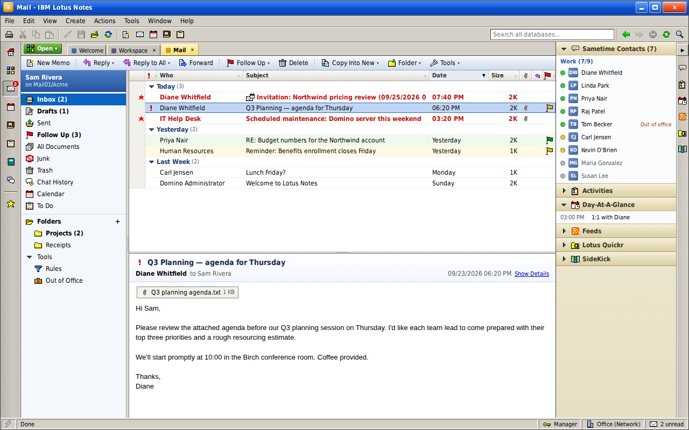
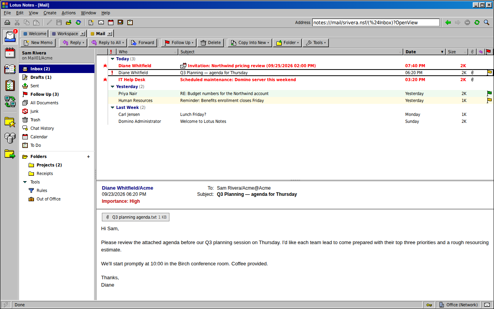
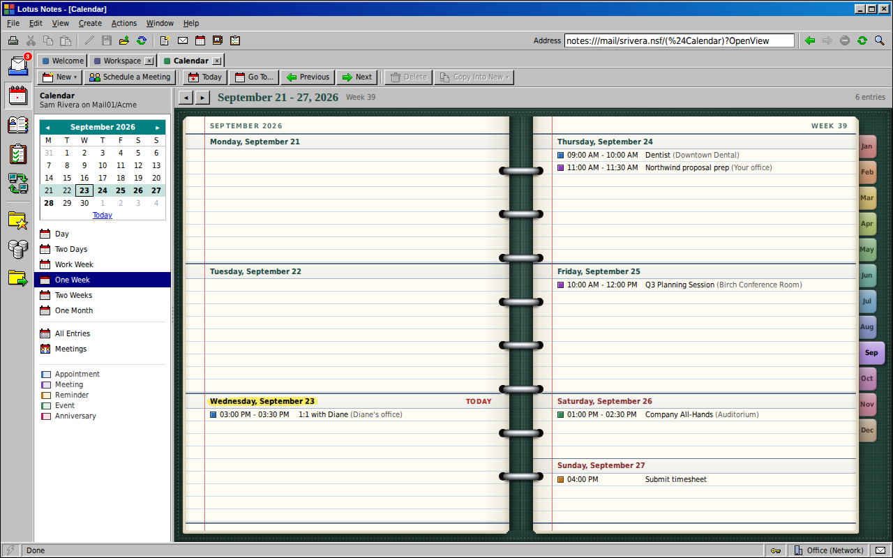
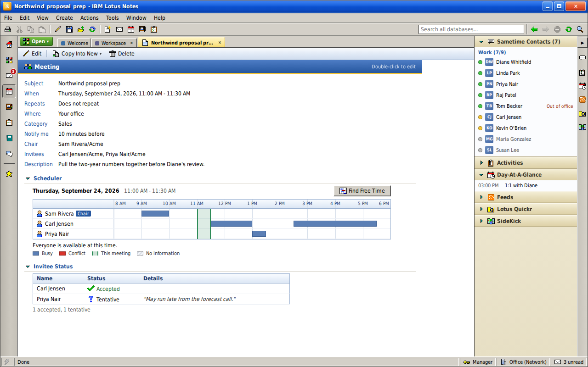
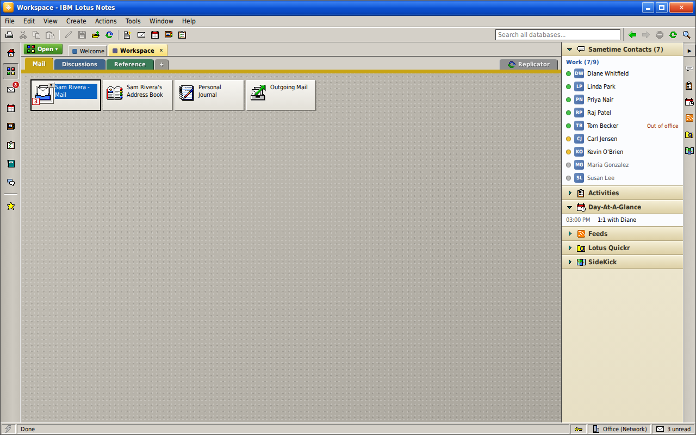

# Lotus Notes

A working recreation of the classic Lotus Notes client for the browser. It
looks like Notes (two themes: Notes 8 on Windows XP, and Notes R5 on Windows
98) and it behaves like Notes: every view and document opens in its own window
tab, views have the selection margin and keyboard, closing a changed document
asks the Notes questions, and a simulated Domino server delivers mail,
answers meeting invitations, bounces bad addresses and replicates.







## What it does

### The client
- **Enter Password** at startup, with the hieroglyph pictures that change as
  you type and X's instead of characters (any non-empty password works).
  **F5** locks your ID and brings the prompt back.
- **Window tabs** for every open view and document. Tabs stay alive when you
  switch, so a half-written memo is still there when you come back. Back and
  Forward move through the windows you visited; the R5 address field shows
  and accepts `notes://` addresses.
- **Menus** built from the current window: File, Edit, View, Create, Actions
  (the window's action bar), Text (while you edit rich text), Window and Help.
  Alt or F10 activates the menu bar and Alt+letter opens a menu, with the
  mnemonics underlined.
- **SmartIcons** that change to the text set while you edit, and a **status
  bar** with the network lightning bolt, the message area (click for recent
  messages), font, size and style pop-ups while editing, your access level,
  the location, and the envelope that lights up when new mail arrives.
- **Themes that change components**, not only colors. R5 has the Windows 98
  caption, the big bookmark bar with Favorite Bookmarks, Databases and More
  Bookmarks folders, the black selection box in views, corner-bracketed
  fields, and no Notes 8 sidebar. Notes 8 has the XP caption, the Open
  button, the slim bookmark rail and the sidebar (Sametime contacts,
  Day-At-A-Glance, Feeds and more).
- **Workspace** pages of database icons with unread counts, stacked replica
  icons (pick Local or the server copy), a textured page, colored page tabs you
  rename and recolor by double-clicking, icons you drag between pages, right-
  click Database Properties and Access Control, and the Replicator tab at the
  end.
- **Notes dialogs** for everything (message boxes, prompts, the Properties
  InfoBox with the Fields tab, User Preferences, Open Database, New Database
  from a template). A new database gets an icon, its About document, and its
  own window.

### Views and documents
- One view component for every database: the selection margin (check marks,
  red unread stars, trash cans for documents marked for deletion), twistie
  categories and response hierarchies, sortable and resizable columns that
  are remembered, and the keyboard (arrows, Enter opens, Space checks,
  Insert toggles unread, + and - expand and collapse, typing starts Quick
  Search, F9 refreshes).
- **Delete marks** documents; F9 or leaving the view asks whether to delete
  them. Right-click gives each row its menu.
- Documents open in their own window, new ones in edit mode. Ctrl+E switches
  to edit mode, Ctrl+S saves, and Esc on a changed document asks "Do you want
  to save your changes?". A new memo gets the Close Window dialog instead
  (Send and save a copy, Send only, Save only, Discard changes).
- **DocLinks**: Edit > Copy as Link > Document Link on any document, paste it
  into rich text, click it to open the document.
- **Document Properties** (Alt+Enter) lists every item on the Fields tab, the
  way Notes stored it.

### Mail
- Inbox, Drafts, Sent, Follow Up (with colored flags), All Documents, Junk,
  Trash, Chat History, your folders (drag memos onto them) and Tools.
- Memo headers the R5 way (sender and date on the left, To, cc and Subject on
  the right) or the Notes 8 way (big subject, Show Details).
- Addressing with Notes names ("Diane Whitfield/Acme"), type-ahead from the
  Domino Directory and your Address Book, the Address dialog, and groups.
- Delivery Options with importance, return receipts and mood stamps.
- Reply, Reply with History, Reply without Attachments, Reply to All,
  Forward, Send and File, Copy Into New Calendar Entry or To Do.
- Rules that run when mail arrives, and Out of Office with the classic reply.
- Meeting invitations with Accept, Decline, Tentative, Delegate and Propose
  New Time.

### The simulated Domino server
- Colleagues answer your memos, accept or decline your meetings based on their
  free time, send new mail every few minutes, and post to the discussion.
- Unknown names come back as a DELIVERY FAILURE report; Tom Becker is out of
  the office and says so.
- **Locations**: at the Office mail goes straight to the server; at Home or
  Travel it waits in Outgoing Mail until you replicate; on the Island nothing
  can reach the server ("Unable to find path to server.").
- **Replication** with deletion stubs and sequence numbers: deletions
  replicate instead of coming back, and edits made on both sides produce a
  "[Replication or Save Conflict]" document. The Replicator page shows each
  database with its pending changes, progress and schedule.

### Calendar and Scheduling
- Day, Two Days, Work Week, One Week, Two Weeks and One Month views with a
  date picker, plus All Entries and Meetings lists. The Classic theme draws the
  week views as the R4/R5 ring-bound planner with month tabs.
- Appointments, meetings, reminders, events and anniversaries; daily, weekly,
  monthly and yearly repeats; drag an entry to reschedule it; alarms fire in
  any window with Snooze and Done.
- Meetings send invitations by mail. The Scheduler shows everyone's free and
  busy time and finds a free slot; the Invitee Status table fills in as
  colleagues accept, tentatively accept, decline or propose a new time.
  Moving a meeting offers to send a reschedule notice, and deleting it a
  cancellation. Invitations you receive can also be delegated.



### The other databases
- **Address Book**: Contacts with an A-Z index, By Category and Groups views,
  a business card preview, the Contact form, and vCard import and export.
- **To Do**: By Due Date (Overdue, Today, Tomorrow, This Week...), By
  Category, By Status and Complete, with Mark Complete.
- **Personal Journal**: By Date and By Category, rich text pages.
- **Discussion**: threaded All Documents and By Category views, By Author,
  My Documents, Main Topic / Response / Response to Response forms, and unread
  marks for posts that arrive by replication. Create a second discussion or
  journal from its template with File > Database > New.
- **Acme's Directory** (read-only Domino Directory) and **Lotus Notes Help**
  (Contents, Index and Search, plus Help > About This Database and Using This
  Database for every database).



## Tech

- React 18 and TypeScript, bundled with Vite.
- Zustand stores persisted to IndexedDB: the documents (`src/data/store.ts`)
  and the desktop (`src/data/ui.ts`: window tabs, Workspace pages, bookmarks,
  view settings).
- No backend: the Domino server is simulated in the page
  (`src/data/server.ts`, `router.ts`, `replication.ts`, `scheduling.ts`).
- Icons are original pixel art drawn as rows of palette characters and
  rendered as crisp SVG (`src/components/icons`). The UI font falls back to a
  bundled subset of DejaVu Sans Condensed where Tahoma is not installed.
- Memo HTML is sanitized on display and on import.

## Getting started

```bash
npm install
npm run dev      # start the dev server
npm test         # unit tests (Vitest)
npm run build    # type-check and build into dist/
```

`dev/icons.html`, `dev/password.html` and `dev/planner.html` are development
pages for the icon set, the password dialog and the planner.

## Project layout

```
src/
  App.tsx               the client window
  shell/                title bar, menus, toolbar, bookmark bar, window tabs,
                        status bar, Workspace, Welcome, dialogs, background
                        services (server, alarms, replication), keyboard
  components/           NotesView, ActionBar, dialogs, menus, document forms,
                        rich text, pixel icons
  apps/                 one folder per database: mail, calendar, contacts,
                        todo, journal, discussion, help, directory, outbox,
                        search, replication
  data/                 document types, stores, seed data, the simulated
                        server, router, replication and scheduling
  styles/               tokens (both themes), chrome, shared view layout,
                        and one stylesheet per module
```

## Disclaimer

An independent homage for nostalgia and demonstration. "Lotus" and "Notes" are
trademarks of their respective owners; this project is not affiliated with or
endorsed by them.
